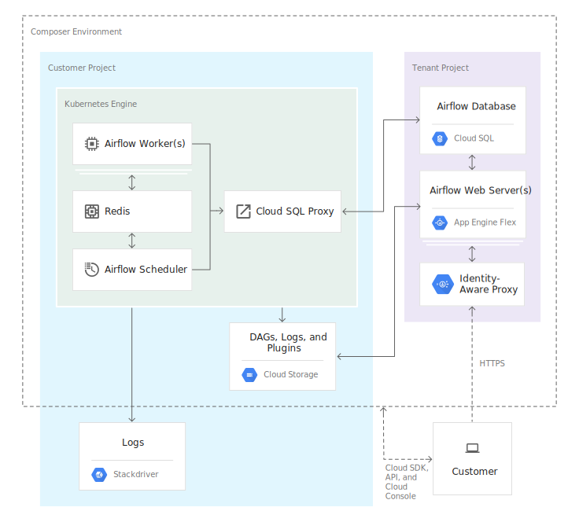

# Cloud Composer

- Fully managed workflow orchestration service based on Apache Airflow.
    - No need to provision resources.
- Pipelines are configured as DAGs
- Workflows live on-premises, in multiple clouds, or full within GCP
- Provides ability to author, schedule, and monitor your workflows in a unified manner.
- Multi-cloud
- Can use Python to dynamically author and schedule workflows.

## Environments
- Airflow is a micro-service architected framework.
    - To deploy in a distributed setup, Cloud Composer provisions several GCP components, collectively known as an Environment.
- Can create one or more inside a project.
- Self contained Airflow deployments based on GKE.
- Work with GCP services through connectors built into Airflow.

## Architecture
- Distributes environment’s resource between a Google-managed tenant project and a customer project.
- For unified Cloud IAM access control and an additional layer of data security, Cloud Composer deploys Cloud SQL and App Engine in the tenant project.

### Tenant Project
- Cloud SQL
    - Stores Airflow metadata.
    - Composer limits database access to the default or specified custom service account used to create the environment.
    - Metadata backed up daily.
    - Cloud SQL proxy in GKE cluster
        - Used to remotely authorize access to your Cloud SQL database from an application, client, or other GCP service.
- App Engine
    - Hosts the Airflow web server.
    - Integrated with Cloud IAM by default.
    - Assign composer.user role to grant access only to Airflow web server.
    - Can deploy a self-managed Airflow web server in customer project (for orgs with additional access-control reqs)

### Customer Project
- Cloud Storage
    - Used for staging DAGs, plugins, data dependencies, and logs.
    - To deploy workflows (DAGs), copy files to the bucket for you environment.
    - Composer takes care of synchronizing DAGs among workers, schedulers, and the web server.
- GKE
    - Scheduler, worker nodes, and CeleryExecutor here.
    - Redis
        - Message broker for the CeleryExecutor
            - Runs a StatefulSet application so that messages persist across container restarts.
    - Allows use of KubernetesPodOperator to run any container workload.
    - Composer enables auto-upgrade and auto-repair to protect against security vulnerabilities.
        - Can perform manual upgrade too.
    - Service Accounts
        - Worker and scheduler nodes and the web server run on different service accounts.
        - Scheduler and workers
            - If service account is not specified during environment creation, default Compute Engine service account is used.
        - Web Server
            - Auto generated during environment creation and derived from webserver domain.

## Stackdriver
- Integrates to have a central place to view all Airflow service and workflow logs.
- Can view logs of scheduler and worker emit immediately instead of waiting for Airflow logging module synchronization (due to streaming nature of Stackdriver)

## Airflow
- DAGs
    - Composed of Tasks
    - Connects independent tasks and executes in specified sequence.
- Tasks
    - Created by instantiating an Operator class.
    - Logical unit of code.
    - Link Tasks/Operators in your DAG python code.
- Operators
    - Template to wrap and execute a task.
    - BashOperator is used to execute a bash script.
    - PythonOperator is used to execute python code.
    - Specify DAG when instantiating Operator.
    - Sensors
        - Special type of Operator that will keep running until a certain criterion is met.
- Task Instance
    - Represents a specific run of a task is is characterized by a combination of a dag, a task, and a point in time.
    - Has a state (running, success, failed, skipped, up for retry, etc)
- CeleryExecutor
    - Used to execute multiple DAGs in parallel
    - Requires a message broker.
    - SequentialExecutor is used for one DAG at a time.

## IAM
- Composer.Admin
- Composer.environmentAndStorageObjectAdmin
- Composer.environmentAndStorageObjectViewer
- Composer.user
- Composer.worker – service accounts
