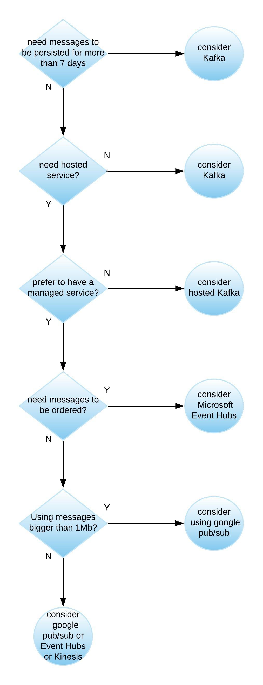

# Apache Kafka

- Stream processing for unbounded datasets.
- Similar to PubSub
- Kafka Connect
    - A tool for scalably and reliably streaming data between Apache Kafka and other systems.
    - There are connectors to PubSub/Dataflow/BigQuery
    
## Compared to PubSub
- Can have precisely once delivery with Spark direct Connector in addition to at least once.
    - Only at least once with PubSub
- Guaranteed ordering within a partition.
    - No ordering guaranteed with PubSub
- No max persistence period
    - 7 days or until acknowledged by all subscribers for PubSub
- Partitioning under user control
    - Partitioning control abstracted away with PubSub
- Cluster Mirroring for disaster recovery
    - Automated disaster recover for PubSub
- 1MB max size for data blobs
    - 10 MB max size for PubSub
- Can change partitioning after setup (does not repartition existing data)
    - Not under user control with PubSub
- Pseudo push model supported using Spark.

