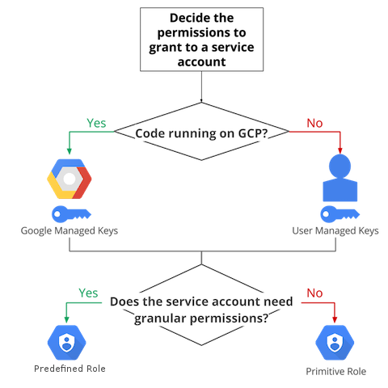

# Cloud Identity and Access Management (IAM)

- Cloud IAM
- Provides administrators the ability to manage cloud resources centrally by controlling who can take what action on specific resources.
- Primitive Roles
- Owner, Editor, Viewer
- Predefined Roles
- Finer grained access control than primitive roles.
- Custom Roles
- Create to tailor permissions to the needs of your org when predefined do not meet your needs.
- Can set Cloud IAM policy at any level in resource hierarchy:
- Organization
- Project
- Resource
- Using IAM Securely
- Least Privilege
- Avoid primitive roles, instead grant predefined roles
- Grant primitive in the following cases:
- GCP service does not provide a predefined role.
- You want to grant broader permissions for a project. (dev or test environments)
- Work in a small team where the team members don’t need granular permissions.
- Treat each component of your application as a separate trust boundary.
- Multiple services that require different permissions, create a service account for each service and then grant only the required permissions to each SA.
- Remember that a policy set on a child resource cannot restrict access granted on its parent.
- Grant roles at the smallest scope needed.
- Restrict who can act as service accounts. Users granted the Service Account Actor role for a SA can access all the resources for which the SA has access.
- Restrict who has access to create and manage SAs in your project.
- Granting the Project IAM Admin and Folder IAM Admin predefined roles will allow access to modify Cloud IAM policies without also allowing direct read, write, and administrative access to all resources.
- Granting Owner role to a member will allow them to access and modify almost all resources, including modifying Cloud IAM policies.
- Service Account and Service Account Keys
- Rotate your service account keys using the Cloud IAM service account API.
- Create a new key, switching applications to use new key, deleting old key.
- Implement processes to manage user-manages service account keys.
- Be careful not to confuse encryption keys with SA keys.
- Do not delete SAs that are in use by running instances.
- Use the display name of a SA to keep track of what they are used for and what permissions they should have.
- Don’t check in the SA keys into source code or leave them in the Downloads directory.
- Auditing
- Use Cloud Audit Logging logs to regularly audit changes to your Cloud IAM policy.
- Export audit logs to GCS to store for long periods of time.
- Audit who has the ability to change your IAM policies on your project.
- Restrict access to logs using Logging roles.
- Apply the same access policies to the GCP resource that you use to export logs as applied to the logs viewer.
- Use Cloud Audit Logging logs to regularly audit access to SA keys.
- Policy Management
- Set organization level Cloud IAM policies to grant access to all projects in your organization.
- Grant roles to a Google group instead of individual users when possible.
- Easier to add/remove members to/from a group.
- If you need to grant multiple roles to allow a particular task, create a Google group, grant the roles to that group, and then add users to that group.
- Billing
- Billing Account Administrator role
- Allows management of payments and invoices without granting permission to view the project contents.
- Billing Account User role
- Gives SA permissions to enable billing and therefore permit the SA to enable APIs that require billing to be enabled.
- Billing Account Creator role
- Allows developers to create new billing accounts and to attach billing accounts to the projects.
- Viewer role
- Allows developers to view the expenses for the projects they own.
- https://cloud.google.com/docs/enterprise/best-practices-for-enterprise-organizations#identity-and-access-management
- https://cloud.google.com/iam/docs/understanding-roles
- Data Loss Prevention API
- Handle sensitive data (especially redaction of PII data)
- Data -> Data Loss Prevention API -> Redacted Data
- Understand encryption techniques (in Cloud Storage Section)
- Legal Compliance
- Health Insurance Portability and Accountability Act (HIPAA)
- Children’s Online Privacy Protection Act (COPPA)
- FedRAMP
- General Data Protection Regulation (GDPR)

