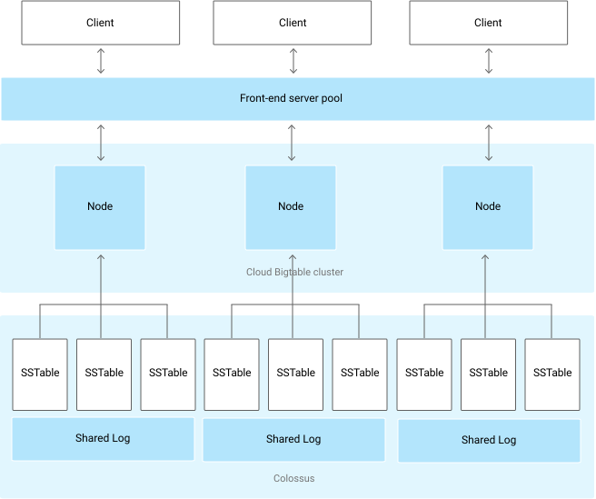

# BigTable

- HBase equivalent
    - Work with it using HBase API
    - Advantages over HBase
        - Scalability (storage autoscales)
        - Low ops/admin burden
        - Cluster resizing without downtime
        - Many more column families before performance drops (~100K)
- Stored on Google’s internal store Colossus
- Not transactional (can handle petabytes of data)
- Fast scanning of sequential key values
- Column oriented NoSQL database
    - Good for sparse data
- Sensitive to hot spotting (like Spanner)
    - Data is sorted on key value and then sequential lexicographically similar values are stored next to each other.
    - Need to design key structure carefully.
- Designed for Sparse Tables
    - Traditional RDBMS issues with sparse data
        - Can’t ignore with petabytes of data.
        - Null cells still occupy space.
- Use BigTable When:
    - Very fast scanning and high throughput
        - Throughput has linear growth with node count if correctly balanced.
    - Non-structured key/value data
    - Each data item is < 10MB and total data > 1TB
    - Writes are infrequent/unimportant (no ACID) but fast scans crucial
    - Time Series data
- Avoid BigTable When:
    - Need transaction support
    - Less than 1TB data (can’t parallelize)
    - Analytics/BI/data warehousing
    - Documents or highly structured hierarchies
    - Immutable blobs > 10MB each

## IAM
- Project wide or instance level
- Bigtable.admin
- Bigtable.user
    - App developer or service accounts.
- Bigtable.reader
    - Data scientists, dashboard generators, and other data analytics.
- Bigtable.viewer
    - Provides no data access.
    - Minimal set of conditions to access the GCP Console for BigTable.

## 4-Dimensional Data Model
- Row-Key
    - Uniquely identifies a row
    - Can be primitives, structures, arrays
    - Represents internally as a byte array
    - Sorted in ascending order
    - **NOTE** - Can only query against this key.
- Column Family
    - Table name in RDBMS
    - All rows have the same set of column families
    - Each column family is stored in a separate data file
    - Set up at schema definition time
        - Columns can be added on the fly
    - Can have different columns for each row
- Column
    - Columns are units within a column family.
- Timestamp
    - Support for different versions based on timestamps of same data item. (like Spanner)
    - Omit timestamp gets you the latest data.

## Hotspotting
- Overloading a node with requests.
- Row keys to Use
    - Field Promotion
        - Move fields from column data that you need to search against should be included in a single row key.
        - Use in reverse URL order like Java package names
            - Keys have similar prefixes, but different endings
    - Salting
        - Hash the key value
    - Timestamps as suffix in key (reverse timestamp)
- Row Keys to Avoid
    - Domain names (as opposed to field promotion)
        - Will cause common portion to be at end of row key leading to adjacent values to not be logically related.
    - Sequential numeric values.
    - Timestamps alone
    - Timestamps as prefix of row-key.
        - Mutable or repeatedly updated values.

## Schema Design
- Each table has just 1 index – row key
- Rows sorted lexicographically by row key
- All operations are atomic at row level
- Keep all entity info in a single row.
- Related entities should be in adjacent rows
    - More efficient reads.
- Tables are sparse: Empty columns don’t take up any space.
    - Create a very large number of columns even if most are empty in most rows.

## “Warming the Cache”
- BigTable will improve performance over time.
- Will observe read and write patterns and redistribute data so that shards are evenly hit.
- Will try to store roughly same amount of data in different nodes.
- Testing over hours is important to get true sense of performance.

## SSD or HDD Disks
- Use SSD unless skimping costs.
    - Can be 20x faster on individual row reads.
        - Less important with batch reads or sequential scans.
    - More predictable throughput too (no disk seek variance)
- When to use HDD?
    - If > 10 TB storage
    - All batch queries
    - Not using the data to back a user-facing or latency-sensitive application
    - Data archival, where you write very large amounts of data and rarely read that data.
- The more random access, the stronger case for SSD
    - Purely random -> maybe use DataStore
- Impossible to switch between SSD and HDD
    - Export data from the existing instance and import data into a new instance.
    - OR write a cloud Dataflow or Hadoop MapReduce job that copies the data from one instance to another.

## Poor Performance Explained
- Poor schema design
- Inappropriate workloads
    - Too small (< 300 GB)
    - Used in short bursts
- Cluster too small
- Cluster just fired up or scaled up
- HDD instead of SSD
- Dev. Vs. Prod instance

## Replication on Performance (new cluster)
- Reads and Scans
    - Replication can improve throughput especially with multi-cluster routing.
    - Can reduce read latency by placing BigTable data geographically closer to application’s users.
- Write throughput
    - Replication does not increase write throughput. May actually go down since replication requires each additional cluster to do more work.
    - Adding more nodes intra cluster will increase write throughput.

## Key Visualizer
- Provides daily scans that show usage patterns for each table in a cluster.
- Makes it easy to check whether your usage patterns are causing undesirable results, such as hotspots on specific row keys or excessive CPU utilization.

## Data Update
- Deleting/updating actually write a new row with the desired data.
- Append only, cannot update a single field
- Tables should be tall and narrow
    - Tall – Store changes by appending new rows
    - Narrow – Collapse flags into a single column

## Production & Development
- Prod:
    - Standard instance with 1-2 clusters
    - 3 or more nodes in each cluster
        - Use replication to provide high availability
    - Replication available, throughput guarantee
- Development:
    - Low cost instance with 1 node cluster
    - No replication
- Create Compute Engine instance in same zone as Big Table instance

## Resizing
- Add and remove nodes and clusters with no downtime.

## Tools for interacting with BigTable
- cbt (Command Line tool)
    - Tool for doing basic interactions with BigTable
    - Use this if possible as it is simpler than HBase shell.
- HBase Shell
    - Command-line tool performs admin tasks such as creating and deleting tables.
    - Can update the following without any downtime:
        - Number of clusters/replication settings
        - Upgrade a development instance to production (permanent)

## Architecture
- Entire BigTable project is called an instance.
- BigTable instance comprise of Clusters and Nodes
- Tables belong to instances
    - If multiple clusters, you cannot assign a table to an individual cluster
- Structure (1 Cluster below)
    
    - Data is never stored in BigTable nodes; each node has pointers to a set of tables stored on Colossus (GCS is built on this as well).
        - Rebalancing tablets from one node to another is very fast because the data is not actually copied. Pointers are simply updated.
        - Recovery from the failure of a node is very fast, only metadata needs to be migrated to the replacement node.
        - When BigTable fails, no data is lost.
    - Single table is sharded across multiple tablets.
- Compared to DataStore
    - BigTable queries are on the Key rather than an Index
    - BigTable supports atomicity only on a single row – no transactions
